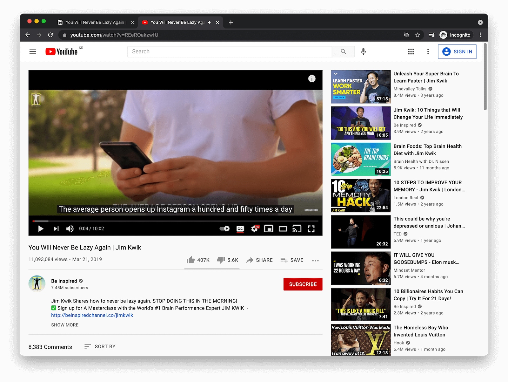
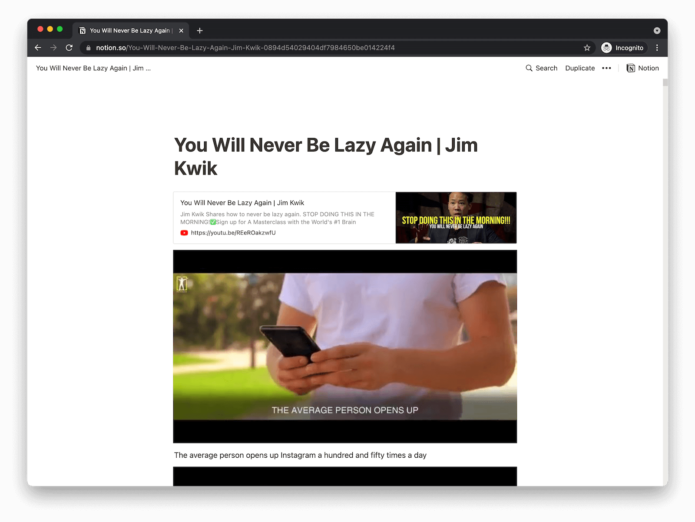

# youtube2notion

> For whom prefers reading than watching

## Example

| YouTube Video                                     | Notion Page                                                                                  |
| ------------------------------------------------- | -------------------------------------------------------------------------------------------- |
|  |                                                |
| https://youtu.be/REeROakzwfU                      | https://www.notion.so/You-Will-Never-Be-Lazy-Again-Jim-Kwik-0894d54029404df7984650be014224f4 |

## How it works

1. Get a youtube video id, a notion token v2, a notion page id by user input
1. Download the youtube video by youtube-dl
1. Split the video into thumbnail images per second by ffmpeg
1. Download the youtube video's subtitle data by youtube_transcript_api
1. Generate a markdown formatted file with the thumbnail images and subtitle
1. Upload the markdown to notion by md2notion

## How to use

1. run youtube2notion container
- [docker-compose.yml file](https://github.com/gnokoheat/docker-collection/blob/main/youtube-to-notion/docker-compose.yml)

```
# docker-compose up -d
```

2. translate youtube to notion command
- [run-command.sh file](https://github.com/gnokoheat/docker-collection/blob/main/youtube-to-notion/run-command.sh)

```
# ./run-command.sh

Enter a video id:
Enter a notion page url:
Enter a notion token v2:
```
